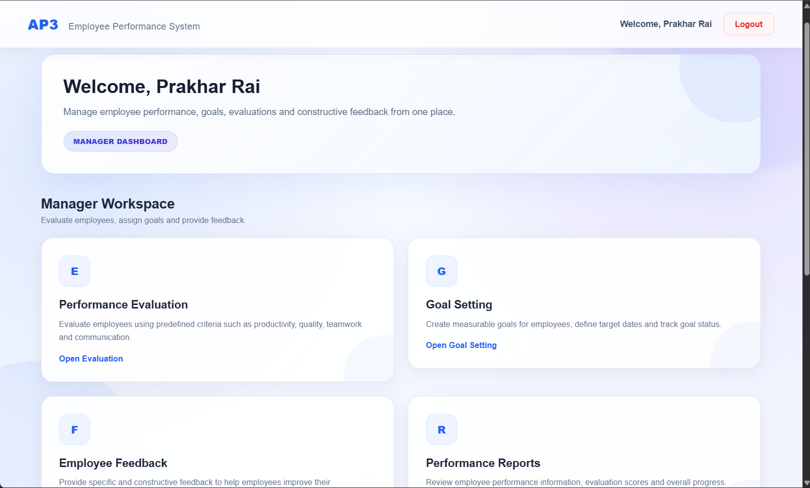
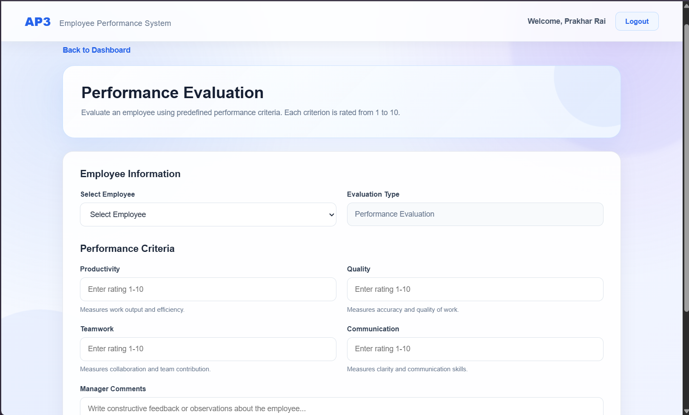
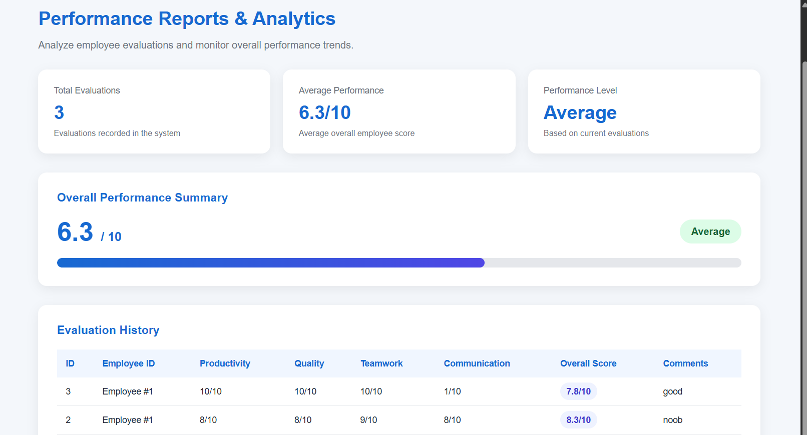
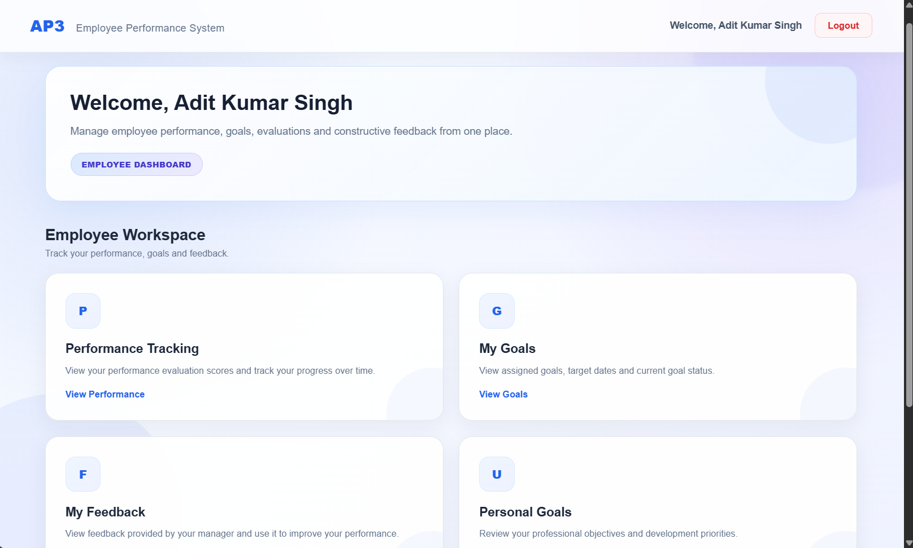
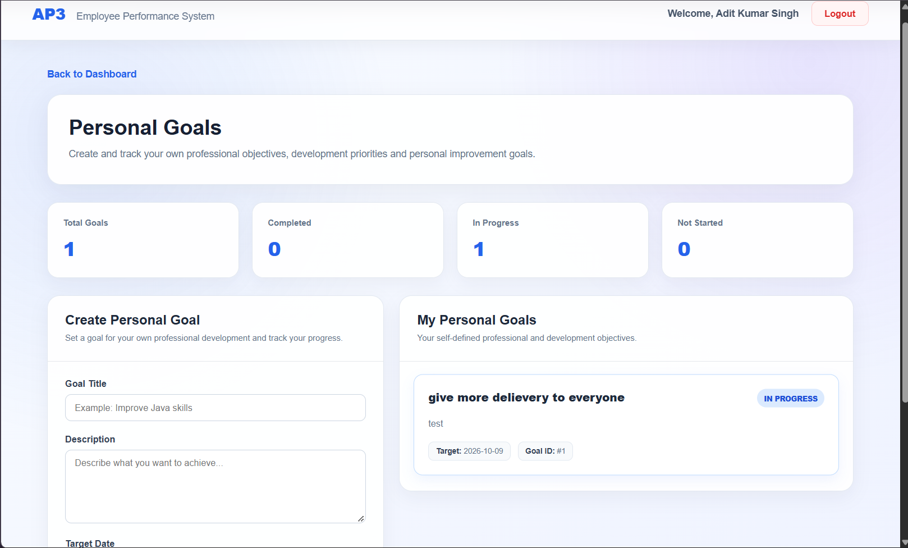

# Employee Performance Evaluation System

A Java-based web application designed to manage employee performance evaluations, goal setting, feedback, and performance reports through separate Manager and Employee dashboards.

## Project Information

- **Project:** Employee Performance Evaluation System
- **Team:** AP3
- **University:** Galgotias University
- **Course:** Engineering Design and Prototyping

## Team Members

| Name | Role |
|---|---|
| Adit Kumar Singh | Admin |
| Prakhar Rai | Manager |
| Pulkit | Member |
| Pushkar Singh | Member |

## Technologies Used

- **Programming Language:** Java
- **Web Technologies:** JSP, HTML, CSS
- **Backend:** Java Servlets
- **Database:** MySQL
- **Database Connectivity:** JDBC
- **Build Tool:** Maven
- **Server:** Apache Tomcat 10.1
- **IDE:** IntelliJ IDEA

## Features

### Manager Dashboard

- **Performance Evaluation:** Evaluate employees using productivity, quality, teamwork, and communication ratings.
- **Goal Setting:** Set employee goals, descriptions, target dates, and statuses.
- **Employee Feedback:** Provide feedback to employees.
- **Performance Reports:** View evaluation history, average performance scores, and performance levels.
- **Employee Management:** View the employee directory.

### Employee Dashboard

- **Performance Tracking:** View performance evaluation results.
- **My Goals:** View goals assigned by the manager.
- **My Feedback:** Read feedback provided by the manager.
- **Personal Goals:** Create and track individual goals.

## Project Structure

```text
EmployeePerformanceEvaluationSystem/
├── src/
│   └── main/
│       ├── java/com/ap3/
│       │   ├── dao/
│       │   ├── model/
│       │   ├── service/
│       │   ├── servlet/
│       │   └── Evaluatable.java
│       ├── resources/
│       └── webapp/
│           ├── index.jsp
│           ├── login.jsp
│           ├── dashboard.jsp
│           ├── evaluation.jsp
│           ├── goal.jsp
│           ├── feedback.jsp
│           ├── employees.jsp
│           ├── reports.jsp
│           ├── my-performance.jsp
│           ├── my-goals.jsp
│           ├── my-feedback.jsp
│           └── personal-goals.jsp
├── .gitignore
├── LICENSE
├── pom.xml
└── README.md
```

## Database Setup

The application uses a MySQL database named `employee_evaluation`.

1. Install and start MySQL Server.
2. Open MySQL Workbench.
3. Create the database and tables using the project's SQL setup script, `employee_evaluation.sql`, if available.
4. Configure the database connection using your local `db.properties` file.
5. Ensure the database credentials and schema match your local MySQL setup.

**Important:** The local `db.properties` file is excluded from Git. Never commit database passwords or other private credentials.

## Configuration

The local database configuration uses these properties:

```properties
db.url=jdbc:mysql://localhost:3306/employee_evaluation
db.username=root
db.password=YOUR_MYSQL_PASSWORD
```

Replace `YOUR_MYSQL_PASSWORD` with your own local MySQL password. Do not publish the real password.

## How to Run

1. Install Java JDK, Maven, MySQL Server, and Apache Tomcat 10.1.
2. Clone or download this repository.
3. Open the project in IntelliJ IDEA as a Maven project.
4. Configure the local `db.properties` file and prepare the MySQL database.
5. Build the application using Maven:

   ```bash
   mvn clean package
   ```

6. Deploy the generated WAR file from `target/EmployeePerformanceEvaluationSystem.war` to Apache Tomcat.
7. Start Tomcat and open:

   `http://localhost:8080/EmployeePerformanceEvaluationSystem/`

8. Sign in using the accounts configured in your local database.

## Object-Oriented Programming

The project demonstrates Java object-oriented programming concepts, including:

- Classes and objects
- Inheritance
- Interfaces
- Encapsulation
- Separation of responsibilities through model, DAO, service, and servlet layers

## Future Enhancements

- Password hashing and stronger authentication
- Role-based authorization improvements
- Graphical performance analytics
- Employee profile management
- Goal progress updates and notifications
- Automated testing
- ## Application Screenshots

### 1. Login Page


### 2. Manager Dashboard


### 3. Performance Evaluation


### 4. Reports and Analytics


### 5. Employee Dashboard


### 6. Personal Goals


## License

This project is licensed under the MIT License. See the [LICENSE](LICENSE) file for details.

---

**Developed by Team AP3 — Galgotias University**